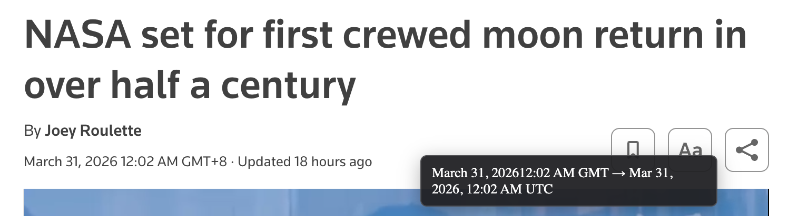

# Timezone Hover Converter

A Chrome extension that detects datetime strings on a page and converts them to the user's preferred timezone on hover.

## Install

1. Open Chrome and navigate to `chrome://extensions`.
2. Enable `Developer mode`.
3. Click `Load unpacked` and select this folder.

## Usage

- Open `Options` from the extension menu or popup.
- Choose your preferred timezone.
- Hover over datetime text such as `Mar 26 10:30AM EST` on any page
- A tooltip will show the converted datetime in your selected timezone.

## Try it here!
- `Mar 20 04:30AM EST`
- `Apr 01 04:30AM SGT`
- `Dec 31 12:30PM GMT+8`

